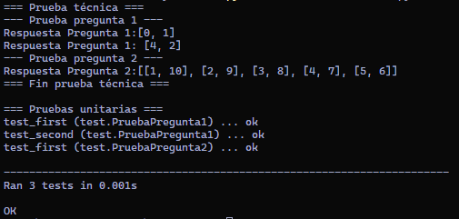

#### Explicación de ejercicios

#### 1. Matriz y conteo de números únicos y repetidos

**Enunciado:** Se tiene una matriz nxn de enteros, crear una función que retorne un arreglo cuyo primer elemento es la cantidad de números que aparecen solo una vez y cuyo segundo elemento la cantidad de términos repetidos.

**Ejemplos:**
```
[[2, 2], [2, 2]] -> [0, 1]
[[2, 1, 3], [4, 5, 2], [6, 6, 6]] -> [4, 2]
```

**Solución:**

1. **Conteo de ocurrencias:** Necesitamos contar cuántas veces aparece cada número en la matriz. Para esto, utilizaremos un diccionario llamado `conteo`:

    ```python
    conteo = {}
    for fila in matriz:
        for numero in fila:
            conteo[numero] = conteo.get(numero, 0) + 1
    ```

    Este código recorre cada elemento de la matriz y actualiza el conteo en el diccionario.
    &nbsp;
2. **Cálculo de únicos y repetidos:** Una vez que tenemos el conteo, podemos determinar cuántos números son únicos y cuántos se repiten:
    &nbsp;
    a. Para contar los números únicos:

    ```python
    unicos = sum(1 for cantidad in conteo.values() if cantidad == 1)
    ```
    b. Para contar los números repetidos:
    ```python
    repetidos = sum(1 for cantidad in conteo.values() if cantidad > 1)
    ```

    La función `sum` se utiliza para contar cuántos elementos cumplen con la condición dada.

3. **Retornamos el resultado:**
    ```python
    return [unicos, repetidos]
    ```

#### 2. Pares de números naturales que suman n

**Enunciado:** Se tiene un número natural n, crear una función que retorne una lista de todos los pares de números naturales que sumen el número n. (n < 10^6)

**Solución:**

1. **Validación de entrada:** Verificamos que n sea un número natural y esté dentro del rango permitido:

    ```python
    if n <= 0 or n >= 10**6:
        return []
    ```
    &nbsp;
2. **Cálculo de pares:** Inicializamos una lista para almacenar los resultados y luego iteramos para encontrar los pares:

    ```python
    resultado = []

    for i in range(1, n // 2 + 1):
        j = n - i
        resultado.append([i, j])

    return resultado
    ```
    Este código recorre los números desde 1 hasta la mitad de n (redondeado hacia abajo). Para cada número i, calculamos j como la diferencia entre n e i. Dado que llegamos hasta la mitad de n, j nunca será mayor que i, por lo tanto agregamos el par [i, j] a la lista de resultados.

#### Resultado de la prueba técnica


#### Ejecución de pruebas unitarias

Para ejecutar las pruebas unitarias, utiliza el siguiente comando en la terminal:

```
python -m unittest -v test.py
```
